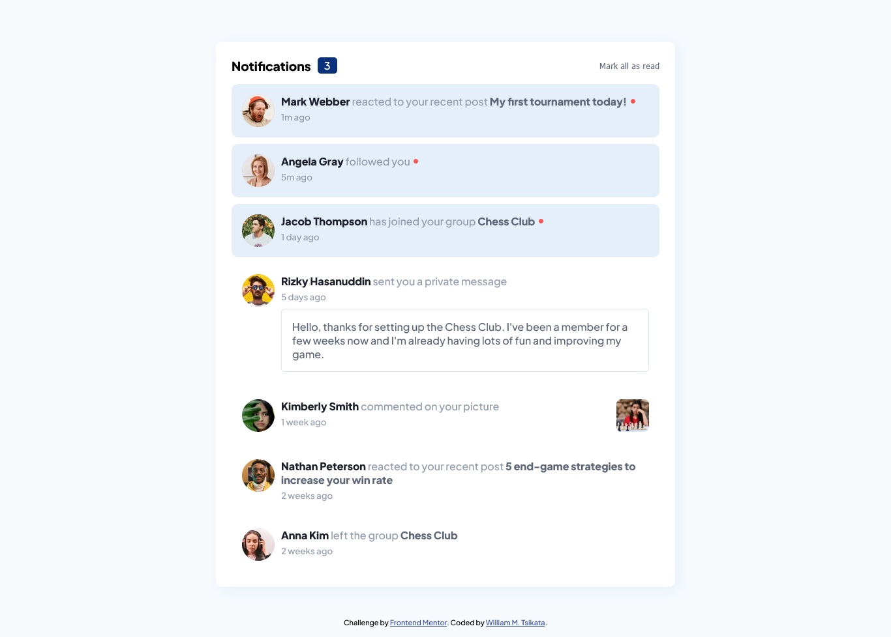

# Frontend Mentor - Notifications page solution

This is a solution to the [Notifications page challenge on Frontend Mentor](https://www.frontendmentor.io/challenges/notifications-page-DqK5QAmKbC). Frontend Mentor challenges help you improve your coding skills by building realistic projects.

## Table of contents

- [Overview](#overview)
  - [The challenge](#the-challenge)
  - [Screenshot](#screenshot)
  - [Links](#links)
- [My process](#my-process)
  - [Built with](#built-with)
  - [What I learned](#what-i-learned)
- [Author](#author)
- [Acknowledgments](#acknowledgments)

## Overview

### The challenge

Users should be able to:

- Distinguish between "unread" and "read" notifications
- Select "Mark all as read" to toggle the visual state of the unread notifications and set the number of unread messages to zero
- View the optimal layout for the interface depending on their device's screen size
- See hover and focus states for all interactive elements on the page

### Screenshot



### Links

- Solution URL: [Add solution URL here](https://your-solution-url.com)
- Live Site URL: [Live site URL](https://tsikatawill.github.io/notifications-page-main/)

## My process

### Built with

- Semantic HTML5 markup
- Vanilla JS
- SCSS

### What I learned

- SCSS Variables

```scss
$Blue: dodgerblue;
$Red: tomato;
```

- Nesting styles with SCSS

```scss
.parent {
  background-color: $Red;

  .child {
    background-color: $Blue;
  }
}
```

- Iterating over a list of elements with JS

```js
const toggleAllRead = () => {
  notificationCards.forEach((card) => {
    if (card.classList.contains("unread")) {
      card.classList.remove("unread");
    }
    notificationCount.style.display = "none";
  });
};
```

## Author

- Website - [William M. Tsikata](https://willfolio-6028d.web.app)
- Frontend Mentor - [@tsikatawill](https://www.frontendmentor.io/profile/tsikatawill)
- Twitter - [@dev_willman](https://www.twitter.com/dev_willman)

## Acknowledgments

I completed this challenge along with Chinaza, Yole and Christian as part of our journey to grow in frontend web development.
